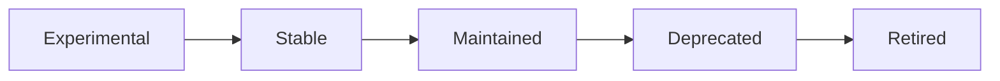

# API Versioning Strategy

Nexis uses **URL path versioning** (`/v1/`, `/v2/`) for its REST API. This document describes how versions are managed, how breaking changes are introduced, and how to migrate between versions.

## Versioning Scheme

All API endpoints are prefixed with a version segment:

```
https://api.nexis.ai/v1/rooms
https://api.nexis.ai/v1/messages
https://api.nexis.ai/v1/search
```

::: tip Why URL Path Versioning?
URL path versioning is explicit, easy to understand, and works well with API gateways, proxies, and documentation generators. It makes the version visible in every request without requiring custom headers.
:::

### Current Version

| Version | Status | Since |
|---------|--------|-------|
| `v1` | **Stable** | 0.1.0 |
| `v2` | Planned | TBD |

## Version Lifecycle



| Phase | Description | Duration |
|-------|-------------|----------|
| **Experimental** | Available behind a feature flag; may have breaking changes at any time | Until stable |
| **Stable** | Full backward compatibility guarantee; documented and tested | Ongoing |
| **Maintained** | No new features; only bug fixes and security patches | ≥ 12 months |
| **Deprecated** | Sunset announced; `Sunset` header in responses | 6 months |
| **Retired** | Endpoint returns `410 Gone` | Permanent |

## Breaking Changes Policy

A change is considered **breaking** if it:

- Removes or renames a field in a request/response payload
- Changes a field's data type
- Removes an endpoint
- Changes an HTTP method or status code
- Modifies authentication or authorization requirements
- Changes WebSocket message formats

### What is NOT Breaking

- Adding new optional fields to response payloads
- Adding new optional query parameters
- Adding new endpoints
- Adding new WebSocket event types
- Changing error message text (error codes remain stable)

### Sunset Header

When an endpoint or version enters the deprecation phase, every response includes a `Sunset` HTTP header:

```http
HTTP/1.1 200 OK
Content-Type: application/json
Sunset: Sat, 17 Mar 2027 00:00:00 GMT
Deprecation: true
Link: <https://docs.nexis.ai/en/guides/api-versioning>; rel="deprecation"
```

Clients should log or alert on this header to prepare for migration.

## Introducing a New Version

When a breaking change is required, a new major API version is introduced:

### 1. Design the New Version

```rust
// nexis-gateway/src/router/mod.rs

pub fn build_routes() -> Router {
    Router::new()
        // v1 routes remain unchanged
        .route("/v1/rooms", get(list_rooms).post(create_room))
        .route("/v1/rooms/:id", get(get_room).delete(delete_room))
        .route("/v1/messages", post(send_message))
        .route("/v1/search", get(search_messages_get).post(search_messages))
        // v2 routes with breaking changes
        .route("/v2/channels", get(list_channels_v2).post(create_channel_v2))
        .nest("/v2", v2_routes())
}
```

### 2. Run Both Versions in Parallel

Both v1 and v2 are served simultaneously. The old version remains in **Maintained** status for at least 12 months.

### 3. Communicate the Change

- Announce in `CHANGELOG.md` under the new version section
- Publish a migration guide (see below)
- Update the OpenAPI spec at `/v2/openapi.json`
- Post a deprecation notice to the `Sunset` header on v1 responses

### 4. Retire the Old Version

After the deprecation period expires, v1 endpoints return `410 Gone`:

```json
{
  "error": {
    "code": "API_GONE",
    "message": "API v1 has been retired. Please migrate to v2. See https://docs.nexis.ai/en/guides/api-versioning"
  }
}
```

## Migration Guide: v1 → v2

This section will be updated when v2 is released. Below is an example of how migrations are documented.

### Renamed Endpoints

| v1 | v2 | Notes |
|----|----|-------|
| `POST /v1/rooms` | `POST /v2/channels` | Resource renamed |
| `GET /v1/rooms/:id` | `GET /v2/channels/:id` | Resource renamed |
| `POST /v1/messages` | `POST /v2/channels/:id/messages` | Scoped to channel |

### Response Schema Changes

**v1 Response:**
```json
{
  "id": "room_abc123",
  "name": "general",
  "topic": "Team chat",
  "member_count": 5
}
```

**v2 Response:**
```json
{
  "id": "ch_abc123",
  "name": "general",
  "description": "Team chat",
  "type": "public",
  "members": {
    "total": 5,
    "online": 3
  },
  "created_at": "2026-03-17T08:00:00Z",
  "updated_at": "2026-03-17T08:00:00Z"
}
```

### Client Migration Checklist

- [ ] Update base URL from `/v1/` to `/v2/`
- [ ] Replace `room` terminology with `channel`
- [ ] Update request/response schemas
- [ ] Handle new required fields (e.g., `type`)
- [ ] Update WebSocket event type names
- [ ] Monitor `Sunset` headers on v1 responses

## Version Detection in Clients

Clients should log or alert on deprecation signals:

```typescript
// TypeScript SDK
async function request<T>(path: string, options: RequestInit): Promise<T> {
  const response = await fetch(`https://api.nexis.ai${path}`, options);

  // Check for deprecation
  const sunset = response.headers.get('Sunset');
  const deprecation = response.headers.get('Deprecation');
  if (sunset || deprecation === 'true') {
    console.warn(`[Nexis SDK] API deprecated. Sunset: ${sunset}`);
  }

  return response.json();
}
```

## Unversioned Endpoints

The following endpoints are **not versioned** and may change at any time:

| Endpoint | Purpose |
|----------|---------|
| `GET /health` | Health checks |
| `GET /metrics` | Prometheus metrics (machine-readable) |
| `GET /openapi.json` | OpenAPI schema |
| `GET /docs` | Swagger UI |

These are operational endpoints used by infrastructure, not by application clients.

## See Also

- [API Reference](/en/api/reference) — Full endpoint documentation
- [WebSocket API](/en/api/websocket) — WebSocket protocol details
- [Release Process](/en/guides/release-process) — How versions are released
