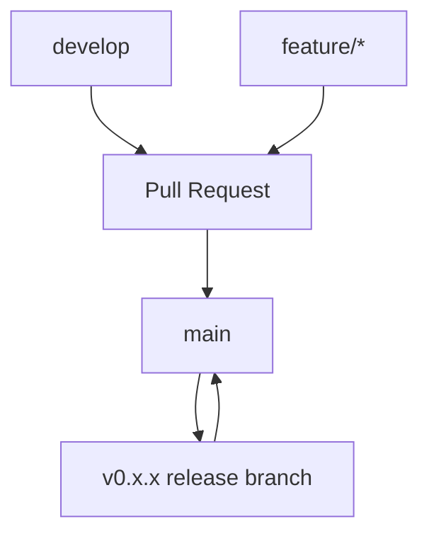

# Release Process

This document describes how Nexis is versioned, built, tested, and released to production.

## Semantic Versioning

Nexis follows [Semantic Versioning 2.0.0](https://semver.org/spec/v2.0.0.html) (`MAJOR.MINOR.PATCH`):

```
v0.1.0  →  v0.2.0  →  v0.2.1  →  v1.0.0
```

### Version Components

| Component | Increment When | Example |
|-----------|---------------|---------|
| **MAJOR** | Incompatible API changes; the public API surface breaks existing clients | `0.2.0` → `1.0.0` |
| **MINOR** | New functionality added in a backward-compatible manner | `0.1.0` → `0.2.0` |
| **PATCH** | Bug fixes; no new features or API changes | `0.2.0` → `0.2.1` |

### Pre-release Versions

Pre-release versions use a hyphen suffix:

```
v0.2.0-alpha.1
v0.2.0-beta.1
v0.2.0-rc.1
```

| Suffix | Purpose |
|--------|---------|
| `alpha` | Internal testing; incomplete features; unstable |
| `beta` | Feature-complete; public testing encouraged |
| `rc` | Release candidate; no changes unless critical bugs found |

### `0.x` Convention

Nexis is currently in `0.x` (pre-1.0). During this phase, **minor version bumps may include breaking changes** at the API level, though we strive to minimize disruption. The stability guarantee fully applies once `1.0.0` is released.

## Branch Strategy



### Branches

| Branch | Purpose | Protected |
|--------|---------|-----------|
| `main` | Production-ready code; always releasable | ✅ |
| `develop` | Integration branch for ongoing development | ✅ |
| `feature/*` | Individual features or bug fixes | ❌ |
| `release/*` | Release preparation (cherry-picks, version bumps) | ✅ |
| `hotfix/*` | Emergency fixes to `main` | ✅ |

### Workflow

1. **Feature development**: Branch from `develop`, open PR back to `develop`.
2. **Integration**: PRs are reviewed, pass CI (fmt, clippy, test, audit), and merged to `develop`.
3. **Release**: `develop` is merged to `main`, tagged, and deployed.
4. **Hotfix**: Branch from `main`, fix, merge back to both `main` and `develop`.

## Changelog

Nexis maintains a changelog in [`CHANGELOG.md`](https://github.com/gbrothersgroup/Nexis/blob/main/CHANGELOG.md) following the [Keep a Changelog](https://keepachangelog.com/en/1.1.0/) format.

### Format

```markdown
## [Unreleased]

### Added
- New feature description

### Changed
- Something changed in existing functionality

### Fixed
- Bug fix description

### Security
- Security vulnerability addressed
```

### Generating the Changelog

The CI release workflow auto-generates a changelog from git commit messages:

```yaml
# .github/workflows/release.yml
- name: Generate changelog
  run: |
    TAG=${GITHUB_REF#refs/tags/}
    PREV_TAG=$(git describe --tags --abbrev=0 HEAD^ 2>/dev/null || echo "")
    if [ -n "$PREV_TAG" ]; then
      LOG=$(git log "$PREV_TAG"..HEAD --pretty=format:"- %s (%h)" --no-merges)
    else
      LOG=$(git log --pretty=format:"- %s (%h)" --no-merges -20)
    fi
```

### Commit Message Convention

To generate useful changelogs, follow [Conventional Commits](https://www.conventionalcommits.org/):

```
feat(rooms): add pagination support for room listing
fix(auth): resolve token refresh race condition
docs(api): update versioning strategy
chore(deps): bump axum to 0.7.5
```

| Prefix | Purpose |
|--------|---------|
| `feat` | New feature (MINOR bump) |
| `fix` | Bug fix (PATCH bump) |
| `feat!` | Breaking change (MAJOR bump) |
| `docs` | Documentation |
| `chore` | Maintenance |
| `refactor` | Code restructuring |
| `perf` | Performance improvement |
| `test` | Test additions/changes |

## CI/CD Pipeline

### CI Pipeline (`ci.yml`)

Runs on every push to `main`/`develop` and on all PRs:

```
┌─────────┐  ┌─────────┐
│   fmt   │  │ clippy  │
└────┬────┘  └────┬────┘
     │            │
     └─────┬──────┘
           ▼
     ┌──────────┐
     │   test   │──→ coverage
     └────┬─────┘
          │
     ┌────▼─────┐
     │   docs   │
     └──────────┘
     
     ┌──────────┐  ┌──────────┐  ┌──────────┐
     │  audit   │  │  codeql  │  │ license  │
     └──────────┘  └──────────┘  └──────────┘
     
     ┌──────────┐
     │container │
     │  scan    │
     └──────────┘
```

| Job | Purpose | Gate |
|-----|---------|------|
| `fmt` | `cargo fmt --check` | Blocks merge |
| `clippy` | `cargo clippy -D warnings` | Blocks merge |
| `test` | `cargo test --workspace` | Required by downstream |
| `coverage` | Generate coverage report (target: 70%) | Informative |
| `docs` | `cargo doc --workspace` | Informative |
| `audit` | `cargo audit` | Blocks merge |
| `codeql` | CodeQL security analysis | Informative |
| `container-scan` | Trivy vulnerability scan | Blocks merge |
| `license-check` | `cargo deny check licenses` | Blocks merge |
| `typescript` | Web app lint + build + test | If `apps/web/` exists |

### CD Pipeline (`release.yml`)

Triggered on version tags (`v*`):

```
Tag: v0.2.0
    │
    ├── Build & Push Docker image → ghcr.io/gbrothersgroup/nexis:0.2.0
    │
    ├── Publish npm packages
    │   ├── @nexis/sdk (TypeScript SDK)
    │   └── @nexis/web (Web UI)
    │
    └── Create GitHub Release
        └── Auto-generated changelog
```

### Release Steps

1. **Prepare**:
   ```bash
   # Ensure develop is up to date
   git checkout develop
   git pull origin develop

   # Update CHANGELOG.md with unreleased entries
   # Bump version in Cargo.toml workspace.package.version
   ```

2. **Tag**:
   ```bash
   git tag -a v0.2.0 -m "Release v0.2.0"
   git push origin v0.2.0
   ```

3. **Automated**:
   - CI runs full test suite
   - Docker image built and pushed to GHCR
   - npm packages published
   - GitHub Release created with changelog

4. **Post-release**:
   ```bash
   # Merge release notes back to develop
   git checkout develop
   git merge main
   git push origin develop
   ```

## Quality Gates

A release must pass all of the following:

| Gate | Requirement |
|------|-------------|
| Zero clippy warnings | `cargo clippy -D warnings` |
| Zero format issues | `cargo fmt --check` |
| All tests pass | `cargo test --workspace` |
| Coverage ≥ 70% | Project-wide line coverage |
| No critical vulnerabilities | Trivy scan + `cargo audit` |
| Docs build | `cargo doc --workspace --no-deps` |

## Rollback Procedure

If a release introduces a critical issue:

1. **Docker**: Re-tag the previous image as `latest`
   ```bash
   docker pull ghcr.io/gbrothersgroup/nexis:0.1.0
   docker tag ghcr.io/gbrothersgroup/nexis:0.1.0 ghcr.io/gbrothersgroup/nexis:latest
   ```

2. **npm**: Deprecate the broken version
   ```bash
   npm deprecate @nexis/sdk@0.2.0 "Critical bug; use 0.1.0"
   ```

3. **Hotfix**: Create a `hotfix/*` branch, fix, and release as a patch version.

## See Also

- [Changelog](https://github.com/gbrothersgroup/Nexis/blob/main/CHANGELOG.md)
- [API Versioning](/en/guides/api-versioning) — API version lifecycle
- [Testing Guide](/en/guides/testing) — Test strategy and coverage
