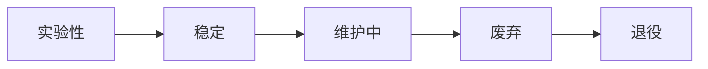

# API 版本管理策略

Nexis 使用 **URL 路径版本控制**（`/v1/`、`/v2/`）管理 REST API。本文档描述版本管理方式、Breaking Changes 引入流程以及版本间迁移指南。

## 版本控制方案

所有 API 端点均带有版本前缀：

```
https://api.nexis.ai/v1/rooms
https://api.nexis.ai/v1/messages
https://api.nexis.ai/v1/search
```

::: tip 为什么选择 URL 路径版本控制？
URL 路径版本控制直观、易理解，与 API 网关、代理和文档生成器兼容性好。每个请求中版本信息一目了然，无需自定义 Header。
:::

### 当前版本

| 版本 | 状态 | 起始版本 |
|------|------|----------|
| `v1` | **稳定** | 0.1.0 |
| `v2` | 计划中 | TBD |

## 版本生命周期



| 阶段 | 描述 | 持续时间 |
|------|------|----------|
| **实验性** | 通过 Feature Flag 提供；可能随时引入 Breaking Changes | 直到稳定 |
| **稳定** | 完全向后兼容保证；已文档化和测试 | 持续 |
| **维护中** | 不再添加新功能；仅修复 Bug 和安全漏洞 | ≥ 12 个月 |
| **废弃** | 发布下线公告；响应中包含 `Sunset` Header | 6 个月 |
| **退役** | 端点返回 `410 Gone` | 永久 |

## Breaking Changes 策略

以下变更被视为 **Breaking Change**：

- 删除或重命名请求/响应中的字段
- 更改字段数据类型
- 删除端点
- 更改 HTTP 方法或状态码
- 修改认证或授权要求
- 更改 WebSocket 消息格式

### 非 Breaking Change

- 向响应中添加新的可选字段
- 添加新的可选查询参数
- 添加新的端点
- 添加新的 WebSocket 事件类型
- 修改错误消息文本（错误码保持稳定）

### Sunset Header

当端点或版本进入废弃阶段，每个响应都包含 `Sunset` HTTP Header：

```http
HTTP/1.1 200 OK
Content-Type: application/json
Sunset: Sat, 17 Mar 2027 00:00:00 GMT
Deprecation: true
Link: <https://docs.nexis.ai/zh-CN/guides/api-versioning>; rel="deprecation"
```

客户端应记录或告警此 Header，为迁移做准备。

## 引入新版本

当需要 Breaking Change 时，引入新的 API 大版本：

### 1. 设计新版本

```rust
// nexis-gateway/src/router/mod.rs

pub fn build_routes() -> Router {
    Router::new()
        // v1 路由保持不变
        .route("/v1/rooms", get(list_rooms).post(create_room))
        .route("/v1/rooms/:id", get(get_room).delete(delete_room))
        .route("/v1/messages", post(send_message))
        .route("/v1/search", get(search_messages_get).post(search_messages))
        // v2 路由包含 Breaking Changes
        .route("/v2/channels", get(list_channels_v2).post(create_channel_v2))
        .nest("/v2", v2_routes())
}
```

### 2. 并行运行两个版本

v1 和 v2 同时提供服务。旧版本进入**维护中**状态，持续至少 12 个月。

### 3. 传达变更

- 在 `CHANGELOG.md` 中公告
- 发布迁移指南（见下文）
- 更新 `/v2/openapi.json` 的 OpenAPI 规范
- 在 v1 响应中添加 `Sunset` Header

### 4. 退役旧版本

废弃期结束后，v1 端点返回 `410 Gone`：

```json
{
  "error": {
    "code": "API_GONE",
    "message": "API v1 已退役。请迁移到 v2。详见 https://docs.nexis.ai/zh-CN/guides/api-versioning"
  }
}
```

## 迁移指南：v1 → v2

本节将在 v2 发布时更新。以下是迁移文档的示例格式。

### 端点重命名

| v1 | v2 | 说明 |
|----|----|------|
| `POST /v1/rooms` | `POST /v2/channels` | 资源重命名 |
| `GET /v1/rooms/:id` | `GET /v2/channels/:id` | 资源重命名 |
| `POST /v1/messages` | `POST /v2/channels/:id/messages` | 限定到频道 |

### 响应结构变更

**v1 响应：**
```json
{
  "id": "room_abc123",
  "name": "general",
  "topic": "Team chat",
  "member_count": 5
}
```

**v2 响应：**
```json
{
  "id": "ch_abc123",
  "name": "general",
  "description": "Team chat",
  "type": "public",
  "members": {
    "total": 5,
    "online": 3
  },
  "created_at": "2026-03-17T08:00:00Z",
  "updated_at": "2026-03-17T08:00:00Z"
}
```

### 客户端迁移清单

- [ ] 将基础 URL 从 `/v1/` 更新为 `/v2/`
- [ ] 将 `room` 术语替换为 `channel`
- [ ] 更新请求/响应结构
- [ ] 处理新增的必填字段（如 `type`）
- [ ] 更新 WebSocket 事件类型名称
- [ ] 监控 v1 响应中的 `Sunset` Header

## 客户端版本检测

客户端应记录或告警废弃信号：

```typescript
// TypeScript SDK
async function request<T>(path: string, options: RequestInit): Promise<T> {
  const response = await fetch(`https://api.nexis.ai${path}`, options);

  // 检测废弃信号
  const sunset = response.headers.get('Sunset');
  const deprecation = response.headers.get('Deprecation');
  if (sunset || deprecation === 'true') {
    console.warn(`[Nexis SDK] API 已废弃。下线时间: ${sunset}`);
  }

  return response.json();
}
```

## 不受版本控制的端点

以下端点**不受版本控制**，可能随时变更：

| 端点 | 用途 |
|------|------|
| `GET /health` | 健康检查 |
| `GET /metrics` | Prometheus 指标（机器可读） |
| `GET /openapi.json` | OpenAPI 规范 |
| `GET /docs` | Swagger UI |

这些是基础设施使用的运维端点，非应用客户端端点。

## 另见

- [API 参考](/zh-CN/api/reference) — 完整端点文档
- [WebSocket API](/zh-CN/api/websocket) — WebSocket 协议详情
- [发布流程](/zh-CN/guides/release-process) — 版本发布方式
