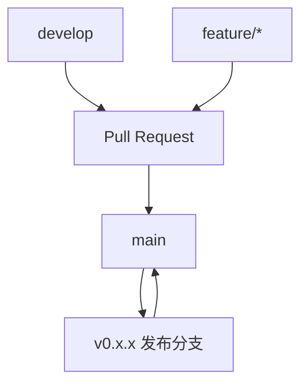

# 发布流程

本文档描述 Nexis 的版本管理、构建、测试和生产发布流程。

## 语义化版本控制

Nexis 遵循 [Semantic Versioning 2.0.0](https://semver.org/spec/v2.0.0.html)（`MAJOR.MINOR.PATCH`）：

```
v0.1.0  →  v0.2.0  →  v0.2.1  →  v1.0.0
```

### 版本组成

| 组成部分 | 递增时机 | 示例 |
|----------|----------|------|
| **MAJOR** | 不兼容的 API 变更；破坏现有客户端 | `0.2.0` → `1.0.0` |
| **MINOR** | 以向后兼容的方式添加新功能 | `0.1.0` → `0.2.0` |
| **PATCH** | Bug 修复；无新功能或 API 变更 | `0.2.0` → `0.2.1` |

### 预发布版本

预发布版本使用连字符后缀：

```
v0.2.0-alpha.1
v0.2.0-beta.1
v0.2.0-rc.1
```

| 后缀 | 用途 |
|------|------|
| `alpha` | 内部测试；功能不完整；不稳定 |
| `beta` | 功能完整；鼓励公开测试 |
| `rc` | 发布候选；除非发现严重 Bug，否则不再变更 |

### `0.x` 约定

Nexis 当前处于 `0.x`（1.0 之前）阶段。在此阶段，**次版本更新可能包含 API 层面的 Breaking Changes**，尽管我们会尽量减少影响。`1.0.0` 发布后，稳定性保证完全生效。

## 分支策略



### 分支说明

| 分支 | 用途 | 受保护 |
|------|------|--------|
| `main` | 生产就绪代码；始终可发布 | ✅ |
| `develop` | 持续开发的集成分支 | ✅ |
| `feature/*` | 单个功能或 Bug 修复 | ❌ |
| `release/*` | 发布准备（cherry-pick、版本号更新） | ✅ |
| `hotfix/*` | 紧急修复到 `main` | ✅ |

### 工作流

1. **功能开发**：从 `develop` 创建分支，向 `develop` 提交 PR
2. **集成**：PR 通过审查、CI（fmt、clippy、test、audit）后合并到 `develop`
3. **发布**：`develop` 合并到 `main`，打标签并部署
4. **热修复**：从 `main` 创建分支，修复后合并回 `main` 和 `develop`

## 变更日志

Nexis 在 [`CHANGELOG.md`](https://github.com/gbrothersgroup/Nexis/blob/main/CHANGELOG.md) 中维护变更日志，遵循 [Keep a Changelog](https://keepachangelog.com/zh-CN/1.1.0/) 格式。

### 格式

```markdown
## [Unreleased]

### Added
- 新功能描述

### Changed
- 现有功能的变更

### Fixed
- Bug 修复描述

### Security
- 安全漏洞修复
```

### 生成变更日志

CI 发布工作流从 Git 提交信息自动生成变更日志：

```yaml
# .github/workflows/release.yml
- name: Generate changelog
  run: |
    TAG=${GITHUB_REF#refs/tags/}
    PREV_TAG=$(git describe --tags --abbrev=0 HEAD^ 2>/dev/null || echo "")
    if [ -n "$PREV_TAG" ]; then
      LOG=$(git log "$PREV_TAG"..HEAD --pretty=format:"- %s (%h)" --no-merges)
    else
      LOG=$(git log --pretty=format:"- %s (%h)" --no-merges -20)
    fi
```

### 提交信息规范

为生成有意义的变更日志，请遵循 [Conventional Commits](https://www.conventionalcommits.org/zh-hans/)：

```
feat(rooms): 为房间列表添加分页支持
fix(auth): 解决 token 刷新竞态条件
docs(api): 更新版本管理策略
chore(deps): 升级 axum 至 0.7.5
```

| 前缀 | 用途 |
|------|------|
| `feat` | 新功能（MINOR 递增） |
| `fix` | Bug 修复（PATCH 递增） |
| `feat!` | Breaking Change（MAJOR 递增） |
| `docs` | 文档更新 |
| `chore` | 维护工作 |
| `refactor` | 代码重构 |
| `perf` | 性能优化 |
| `test` | 测试相关 |

## CI/CD 流水线

### CI 流水线 (`ci.yml`)

每次推送到 `main`/`develop` 及所有 PR 时运行：

```
┌─────────┐  ┌─────────┐
│   fmt   │  │ clippy  │
└────┬────┘  └────┬────┘
     │            │
     └─────┬──────┘
           ▼
     ┌──────────┐
     │   test   │──→ coverage
     └────┬─────┘
          │
     ┌────▼─────┐
     │   docs   │
     └──────────┘

     ┌──────────┐  ┌──────────┐  ┌──────────┐
     │  audit   │  │  codeql  │  │ license  │
     └──────────┘  └──────────┘  └──────────┘

     ┌──────────┐
     │container │
     │  scan    │
     └──────────┘
```

| 任务 | 用途 | 门禁 |
|------|------|------|
| `fmt` | `cargo fmt --check` | 阻断合并 |
| `clippy` | `cargo clippy -D warnings` | 阻断合并 |
| `test` | `cargo test --workspace` | 下游依赖 |
| `coverage` | 生成覆盖率报告（目标：70%） | 参考 |
| `docs` | `cargo doc --workspace` | 参考 |
| `audit` | `cargo audit` | 阻断合并 |
| `codeql` | CodeQL 安全分析 | 参考 |
| `container-scan` | Trivy 漏洞扫描 | 阻断合并 |
| `license-check` | `cargo deny check licenses` | 阻断合并 |
| `typescript` | Web 应用 lint + 构建 + 测试 | 当 `apps/web/` 存在时 |

### CD 流水线 (`release.yml`)

由版本标签（`v*`）触发：

```
标签: v0.2.0
    │
    ├── 构建并推送 Docker 镜像 → ghcr.io/gbrothersgroup/nexis:0.2.0
    │
    ├── 发布 npm 包
    │   ├── @nexis/sdk (TypeScript SDK)
    │   └── @nexis/web (Web UI)
    │
    └── 创建 GitHub Release
        └── 自动生成变更日志
```

### 发布步骤

1. **准备**：
   ```bash
   # 确保 develop 是最新的
   git checkout develop
   git pull origin develop

   # 更新 CHANGELOG.md 中的未发布条目
   # 更新 Cargo.toml workspace.package.version
   ```

2. **打标签**：
   ```bash
   git tag -a v0.2.0 -m "Release v0.2.0"
   git push origin v0.2.0
   ```

3. **自动化**：
   - CI 运行完整测试套件
   - Docker 镜像构建并推送到 GHCR
   - npm 包发布
   - GitHub Release 创建（含变更日志）

4. **发布后**：
   ```bash
   # 将发布说明合并回 develop
   git checkout develop
   git merge main
   git push origin develop
   ```

## 质量门禁

发布必须通过以下所有检查：

| 门禁 | 要求 |
|------|------|
| Clippy 零警告 | `cargo clippy -D warnings` |
| 格式零问题 | `cargo fmt --check` |
| 所有测试通过 | `cargo test --workspace` |
| 覆盖率 ≥ 70% | 项目级行覆盖率 |
| 无严重漏洞 | Trivy 扫描 + `cargo audit` |
| 文档构建通过 | `cargo doc --workspace --no-deps` |

## 回滚流程

如果发布引入严重问题：

1. **Docker**：将上一个镜像重新标记为 `latest`
   ```bash
   docker pull ghcr.io/gbrothersgroup/nexis:0.1.0
   docker tag ghcr.io/gbrothersgroup/nexis:0.1.0 ghcr.io/gbrothersgroup/nexis:latest
   ```

2. **npm**：废弃问题版本
   ```bash
   npm deprecate @nexis/sdk@0.2.0 "严重 Bug；请使用 0.1.0"
   ```

3. **热修复**：创建 `hotfix/*` 分支，修复后以补丁版本发布。

## 另见

- [变更日志](https://github.com/gbrothersgroup/Nexis/blob/main/CHANGELOG.md)
- [API 版本管理](/zh-CN/guides/api-versioning) — API 版本生命周期
- [测试指南](/zh-CN/guides/testing) — 测试策略和覆盖率
